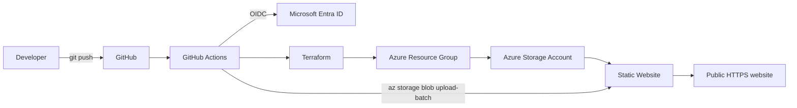

# Enterprise Cloud Infrastructure Design

This repository is a starter implementation for an Azure Infrastructure-as-Code assessment.

## Solution overview

The solution deliberately uses a small application so the technical focus remains on infrastructure, automation, security, CI/CD, testing, cost, scalability and sustainability.



## What is automated

- Terraform formatting and validation.
- Terraform plan on pull requests.
- Terraform apply on the `main` branch.
- Website file deployment after successful infrastructure deployment.
- Azure authentication from GitHub Actions using OpenID Connect (OIDC), avoiding a long-lived Azure client secret.

## Repository structure

```text
.
├── .github/
│   └── workflows/
│       ├── validate.yml
│       └── deploy.yml
├── docs/
│   ├── report-scaffold.md
│   ├── test-plan.md
│   └── presentation-run-sheet.md
├── scripts/
├── terraform/
│   ├── backend.tf
│   ├── main.tf
│   ├── outputs.tf
│   ├── providers.tf
│   ├── variables.tf
│   └── terraform.tfvars.example
├── web/
│   ├── 404.html
│   └── index.html
└── .gitignore
```

## Architecture choice

Azure Storage static website hosting is used instead of a continuously running virtual machine because this demonstration application does not require server-side compute.

That choice gives a useful assessment rationale:

- **Cost:** pay for storage and transactions rather than an always-on VM.
- **Operations:** no guest operating system, patching or web server administration.
- **Scalability:** the managed storage platform serves static content without manually scaling virtual machines.
- **Security:** GitHub authenticates to Azure through OIDC rather than a stored Azure password/secret.
- **Sustainability:** the design avoids provisioning compute capacity that the application does not need.

## Prerequisites

On your Windows machine:

- Azure CLI
- Terraform
- Git
- GitHub account and repository
- An Azure subscription
- PowerShell 7 recommended

Login to Azure:

```powershell
az login
az account show
```

## One-time Azure bootstrap

The Azure bootstrap was completed manually using Azure CLI because the ACU tenant does not permit the student account to create Microsoft Entra application registrations.

The implemented authentication architecture uses a user-assigned managed identity with GitHub OIDC federation:

`GitHub Actions -> GitHub OIDC -> Azure user-assigned managed identity -> Azure RBAC -> Terraform`

The bootstrap created:

1. Azure resource group `rg-enterprise-cloud-assessment`.
2. Azure Storage account and blob container for Terraform remote state.
3. User-assigned managed identity `id-github-enterprise-cloud`.
4. Federated identity credentials for the `main` branch and GitHub pull requests.
5. Contributor and Storage Blob Data Contributor RBAC assignments at resource-group scope.

GitHub repository variables provide the client, tenant, subscription, resource group and Terraform backend identifiers to the workflows.

No Azure client secret or password is stored in GitHub.

## Local Terraform check

Create a local variables file:

```powershell
Copy-Item .\terraform\terraform.tfvars.example .\terraform\terraform.tfvars
```

Then:

```powershell
cd terraform

terraform init `
  -backend-config="resource_group_name=<resource-group>" `
  -backend-config="storage_account_name=<tfstate-storage-account>" `
  -backend-config="container_name=tfstate" `
  -backend-config="key=enterprise-cloud.tfstate" `
  -backend-config="use_azuread_auth=true"

terraform fmt -check
terraform validate
terraform plan
```

For normal assessment use, deployment is performed by GitHub Actions rather than by manually running `terraform apply`.

## CI/CD behaviour

### Pull request

`validate.yml`:

1. Checks out the repository.
2. Authenticates to Azure using OIDC.
3. Installs Terraform.
4. Runs `terraform fmt -check`.
5. Initialises the Azure remote backend.
6. Runs `terraform validate`.
7. Runs `terraform plan`.

This creates a pre-deployment quality gate.

### Main branch

`deploy.yml`:

1. Checks out the repository.
2. Authenticates to Azure through OIDC.
3. Initialises Terraform.
4. Runs validation and plan.
5. Applies the approved infrastructure configuration.
6. Reads the generated storage account name.
7. Uploads `web/` into the Azure `$web` container.
8. Prints the deployed website endpoint.

## Demonstration sequence

For the video:

1. Show the repository.
2. Briefly show the Terraform files.
3. Edit one line in `web/index.html`.
4. Commit and push.
5. Open GitHub Actions and show the workflow executing.
6. Show Terraform validation/apply completing.
7. Open the deployed Azure website and show the changed content.
8. Explain OIDC, remote state, security, cost and sustainability decisions.

